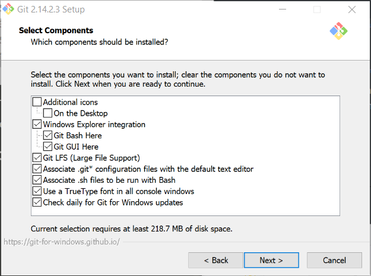

Local Git Tools
===============

*   [SCM](#scm)
*   [Desktop](#desktop)

Git SCM
-------

### Installation

Install from https://git-scm.com/downloads

When installing select the below options:

GitHub Desktop
--------------

### Installation

Install from https://desktop.github.com/

For GitHub Desktop Set terminal to use 'Git Bash':

1. File -> Options
2. From 'Advanced' tab, for shell select Git Bash
3. Click 'Save'

### Use

To add a pre-existing repository, File -> Add Local Repository.

To create a new branch, Branch -> New Branch

To commite changes, add Summary and Description in tab on right hand side.

To create a pull request, Branch -> Create Pull Request. This will open the github site in a browser.

